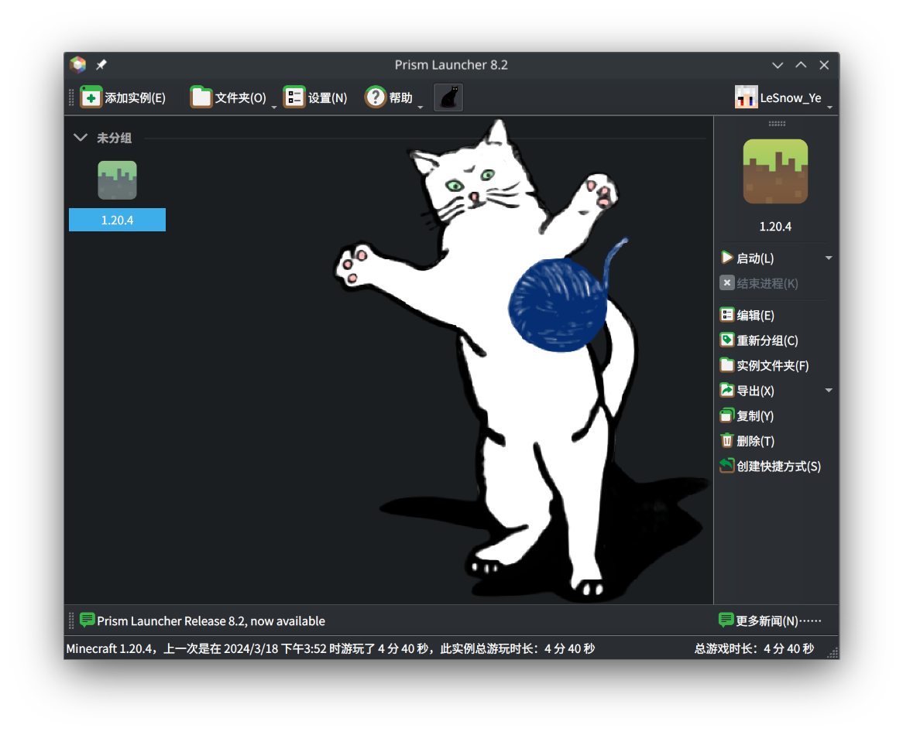

## 前言

大一买了 iPad Pro，带来带去很方便，用来写作业很舒服。但用了一年多，最终还是明白了 iPad 成为不了生产力工具的观点。iPad 确实可以干很多事情，但更多事情是它干不了的，或者不方便干的，尤其是需要键盘的工作。所以 iPad 终究代替不了平板电脑。

但是，原来的笔记本作为游戏本，是十分笨重的，且即使键鼠都是无线的情况下，在宿舍也基本都插上了四五根线来使用，而且续航也十分捉襟见肘，携带外出，实在是非常不方便。

于是萌发出再搞一台轻薄本的想法。MacBook 自然是很好的选择，奈何没钱，pass。先明确一下自己的需求：带去上课用，不需要多强的性能，但一定要轻便和良好的续航。几经搜索，最终锁定了 ThinkPad T480s。

## T480s

T480s 的详细评测可以看这篇文章 [近 10 年 T 系列的设计巅峰——二手 Thinkpad T480s 淘机攻略 02（23 年 12 月更新版）](https://zhuanlan.zhihu.com/p/675776835)。最终也是在文章作者的店里花了 1600 大洋（2024 年 3 月）买下了当年的万元旗舰 T480s（美版、16 + 512、8350u；成色还行，键盘和触控板基本没反光；硬盘 1w 小时通电，但卖家送了块新的 256G 2242）。卖家很诚信地写出了所有的瑕疵，更换了全新的电池，送了口红充电器、鼠标、U 盘、还有一年店保，虽然可能有点王婆卖瓜就是了。

下面简单谈一下 T480s 明显的优劣。

### 优

最重要的是**轻便**（1.3kg），和**超大杯的续航**。装上 Arch 调教好以后能轻松达到八小时以上的续航！极限一点干到十几个小时也没有问题。带去上课可以说戳戳有余了。而且可以带上 65w 的口红充电器。续航焦虑？不存在的。

接口也十分丰富，如图：

作为打字本来说，配置戳戳有余，玩一些简单的游戏也没有问题：

- i5-8350U
- 8G\*2 RAM
- 256G\*2 M.2.
- UHD 620

此外，还有指纹识别、可选的 4G 模块、智能卡槽可以折腾。

### 劣

虽说 i5-8350U 当年挤了一大管牙膏，但放在 2024 年这性能实在是羸弱了，而且一千块能买到同样 U 的机子。好在我们并不需要多强的性能，而且也不是追究极致的价格。

但是屏幕确实是没有借口的烂了，评价为——能看。之后可能会换一块 2k 的屏幕。（最后换了一块 1080P 的，其实笔记本屏幕小，1080P 的 dpi 也不算太低）

## Arch

买来 check 了一下就直接装上 Arch 了，桌面使用 KDE，~~主题是 [Nordic](https://store.kde.org/p/1327093)~~。

> 2024 年 3 月初，KDE Plasma 6 并入了 Arch Stable Repositories，以往很多主题和美化小部件都失效了。
> 由于 Plasma 6 默认使用 Wayland，部分软件也出现了各种小问题。如 fcitx 需要重新配置，传统的全局快捷键实现也失效了。

T480s 额外的设置可以参考官方文档 [Lenovo ThinkPad T480s - ArchWiki](https://wiki.archlinux.org/title/Lenovo_ThinkPad_T480s)。

参考 [5.1 节](https://wiki.archlinux.org/title/Lenovo_ThinkPad_T480s#Thermal_throttling) 进行降压和功耗限制。

~~使用 [TLP](https://wiki.archlinuxcn.org/wiki/TLP) 进行额外的电源管理。~~

### Why Arch

- [Arch Linux - Arch Linux 中文维基](https://wiki.archlinuxcn.org/wiki/Arch_Linux#Simplicity)
- [Arch 与其他发行版的比较 - Arch Linux 中文维基](https://wiki.archlinuxcn.org/wiki/Arch_%E4%B8%8E%E5%85%B6%E4%BB%96%E5%8F%91%E8%A1%8C%E7%89%88%E7%9A%84%E6%AF%94%E8%BE%83)

### 部分软件

#### 办公

WPS 和 OnlyOffice 都挺好，后者更加“自由”。但可惜的是 WPS 对一些公式的支持还是比 OnlyOffice 好一些，但也可能只是我们上课用的 PPT 太古老了吧。

WPS 需要额外安装 `freetype2-wps (AUR)` 来解决部分字符加粗问题。

#### 游戏

Linux 能玩的游戏比之前想象中的多很多。Steam 一装就可以玩很多游戏了。

MC 使用的是 `prismlauncher-qt5-bin`，因为 Plasma 6 Wayland 下 `prismlauncher-bin` 无法启动。（至少 24 年 3 月是酱紫）

### (Why not NixOS)

前段时间参加了 [沙龙：Towards Modern Distro](https://tuna.moe/event/2024/towards-modern-distro/)，觉得 [NixOS](https://nixos.org/) 非常值得一试：**Reproducible**, **Declarative**, Reliable。于是在另一块硬盘上装了一个 NixOS（使用 rEFInd 进行多系统引导），但“为了使用一个系统学一门新的语言”确实让它门槛高了很多，因而相应的生态也较 Arch 要差一些。此外 NixOS 也并不遵循 [Filesystem Hierarchy Standard](https://en.wikipedia.org/wiki/Filesystem_Hierarchy_Standard)。出于种种原因，装完便没有再继续使用了，时间精力有限，以后若有机会，再重新尝试使用吧。

## 后记

~~等使用了一段时间后再来补充更多的使用体验吧。~~

用了一年多了，不得不说生产力是真的杠杠的，除了极少情况（浏览器开了一堆页面 + Godot 写游戏吃掉太多内存 or 高 GPU 需求的时候）完全没有任何压力。
